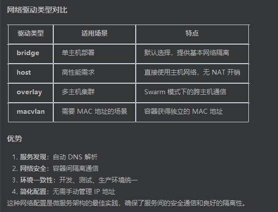

# Docker Compose 配置详解

> 基于 `docker-compose.yaml`，逐块拆解各配置的含义与设计思路。

---

## 源码解析

```
# Docker Compose - 本地开发环境
# 一键启动所有依赖服务（PostgreSQL、Redis、Prometheus、Grafana）
# 使用方式：docker-compose up -d
#
# 这模拟了生产环境中各个组件的配合：
# - 应用服务（saas-shortener）
# - 数据库（PostgreSQL） → 生产环境用云数据库（如 AWS RDS）
# - 缓存（Redis）→ 生产环境用云 Redis（如 AWS ElastiCache）
# - 监控（Prometheus）→ 生产环境用 Prometheus Operator
# - 可视化（Grafana）→ 生产环境用 Grafana Cloud 或自建
#
# ==================== 资源规划（2C4G 服务器） ====================
# 组件          | 内存限制 | 说明
# Go 应用       | 128MB   | Go 二进制非常轻量
# PostgreSQL    | 512MB   | 适当限制 shared_buffers
# Redis         | 128MB   | 学习项目数据量小
# Prometheus    | 512MB   | 限制时序数据内存占用
# Grafana       | 256MB   | 前端服务
# 合计          | ~1.5GB  | 预留约 2.5GB 给系统和 Docker 引擎

services:
  # ==================== 应用服务 ====================
  app:
    build:
      context: ../../
      dockerfile: deploy/docker/Dockerfile
    container_name: saas-shortener
    ports:
      - "8080:8080"
    environment:
      # 12-Factor App: 所有配置通过环境变量注入
      - APP_ENV=development
      - SERVER_PORT=8080
      - DB_HOST=postgres
      - DB_PORT=5432
      - DB_USER=postgres
      - DB_PASSWORD=postgres
      - DB_NAME=saas_shortener
      - DB_SSLMODE=disable
      - REDIS_ADDR=redis:6379
      - REDIS_PASSWORD=
      - TENANT_DEFAULT_RATE_LIMIT=100
      - TENANT_MAX_URLS=1000
      # Go 运行时优化（小内存服务器）
      - GOMAXPROCS=2
      - GOMEMLIMIT=100MiB
    depends_on:
      postgres:
        condition: service_healthy
      redis:
        condition: service_healthy
    restart: unless-stopped
    # 资源限制 - 防止单个容器吃满内存导致 OOM
    deploy:
      resources:
        limits:
          cpus: '0.5'
          memory: 128M
        reservations:
          cpus: '0.1'
          memory: 32M
    networks:
      - saas-network

  # ==================== PostgreSQL 数据库 ====================
  postgres:
    image: postgres:16-alpine
    container_name: saas-postgres
    restart: unless-stopped
    ports:
      - "5432:5432"
    environment:
      - POSTGRES_USER=postgres
      - POSTGRES_PASSWORD=postgres
      - POSTGRES_DB=saas_shortener
    # PostgreSQL 内存优化（适配小内存服务器）
    command:
      - "postgres"
      - "-c" 
      - "shared_buffers=128MB"        # 默认128MB，小服务器够用
      - "-c"
      - "effective_cache_size=256MB"   # 告诉优化器可用缓存大小
      - "-c"
      - "work_mem=4MB"                # 每个排序/哈希操作的内存
      - "-c"
      - "max_connections=50"          # 限制最大连接数（默认100太多）
    volumes:
      - postgres_data:/var/lib/postgresql/data
    healthcheck:
      test: ["CMD-SHELL", "pg_isready -U postgres"]
      interval: 5s
      timeout: 5s
      retries: 5
    deploy:
      resources:
        limits:
          cpus: '0.8'
          memory: 512M
        reservations:
          cpus: '0.2'
          memory: 128M
    networks:
      - saas-network

  # ==================== Redis 缓存 ====================
  redis:
    image: redis:7-alpine
    container_name: saas-redis
    restart: unless-stopped
    ports:
      - "6379:6379"
    # Redis 内存限制：超过后使用 LRU 策略淘汰旧数据
    command: redis-server --maxmemory 64mb --maxmemory-policy allkeys-lru
    volumes:
      - redis_data:/data
    healthcheck:
      test: ["CMD", "redis-cli", "ping"]
      interval: 5s
      timeout: 5s
      retries: 5
    deploy:
      resources:
        limits:
          cpus: '0.3'
          memory: 128M
        reservations:
          cpus: '0.1'
          memory: 32M
    networks:
      - saas-network

  # ==================== Prometheus 监控 ====================
  # Prometheus 是云原生监控的事实标准
  # 它通过 Pull 模式定期从应用的 /metrics 端点拉取指标数据
  prometheus:
    image: prom/prometheus:v2.51.0
    container_name: saas-prometheus
    restart: unless-stopped
    ports:
      - "9090:9090"
    volumes:
      - ../k8s/monitoring/prometheus.yaml:/etc/prometheus/prometheus.yml
      - prometheus_data:/prometheus
    command:
      - '--config.file=/etc/prometheus/prometheus.yml'
      - '--storage.tsdb.path=/prometheus'
      - '--storage.tsdb.retention.time=7d'        # 只保留7天数据（节省磁盘）
      - '--storage.tsdb.retention.size=1GB'        # 最多占用1GB磁盘
      - '--web.console.libraries=/etc/prometheus/console_libraries'
      - '--web.console.templates=/etc/prometheus/consoles'
      - '--web.enable-lifecycle'
    deploy:
      resources:
        limits:
          cpus: '0.5'
          memory: 512M
        reservations:
          cpus: '0.1'
          memory: 128M
    networks:
      - saas-network

  # ==================== Grafana 可视化 ====================
  # Grafana 是最流行的监控可视化平台
  # 它从 Prometheus 读取指标数据，展示成漂亮的仪表盘
  grafana:
    image: grafana/grafana:10.4.0
    container_name: saas-grafana
    restart: unless-stopped
    ports:
      - "3000:3000"
    environment:
      - GF_SECURITY_ADMIN_USER=admin
      - GF_SECURITY_ADMIN_PASSWORD=admin
      - GF_USERS_ALLOW_SIGN_UP=false
    volumes:
      - grafana_data:/var/lib/grafana
      - ../k8s/monitoring/grafana-datasource.yaml:/etc/grafana/provisioning/datasources/datasource.yaml
    depends_on:
      - prometheus
    deploy:
      resources:
        limits:
          cpus: '0.5'
          memory: 256M
        reservations:
          cpus: '0.1'
          memory: 64M
    networks:
      - saas-network

# ==================== 持久化存储 ====================
volumes:
  postgres_data:
  redis_data:
  prometheus_data:
  grafana_data:

# ==================== 网络 ====================
networks:
  saas-network:
    driver: bridge

```

## 整体架构概览

本项目用 Docker Compose 一键启动完整的本地开发环境，包含 5 个服务：

```
┌──────────────────────────────────────────────────────────────┐
│                      saas-network (bridge)                    │
│                                                              │
│  ┌──────────┐    ┌──────────┐    ┌──────────┐               │
│  │ Postgres │    │  Redis   │    │Prometheus│               │
│  │  :5432   │    │  :6379   │    │  :9090   │               │
│  │  512M    │    │  128M    │    │  512M    │               │
│  └────┬─────┘    └────┬─────┘    └────┬─────┘               │
│       │               │               │                      │
│       │ depends_on    │ depends_on    │ depends_on           │
│       │ (healthy)     │ (healthy)     │                      │
│       ▼               ▼               ▼                      │
│  ┌─────────────────────────┐    ┌──────────┐                │
│  │          App            │    │ Grafana  │                │
│  │        :8080            │    │  :3000   │                │
│  │         128M            │    │  256M    │                │
│  └─────────────────────────┘    └──────────┘                │
│                                                              │
│  总计 ≈ 1.5GB，预留 ~2.5GB 给系统和 Docker 引擎               │
└──────────────────────────────────────────────────────────────┘
```

| 组件 | 镜像 | 端口 | 内存限制 | 角色 |
|------|------|------|---------|------|
| App | 本地构建 | 8080 | 128M | Go 应用服务 |
| PostgreSQL | postgres:16-alpine | 5432 | 512M | 关系型数据库 |
| Redis | redis:7-alpine | 6379 | 128M | 缓存 |
| Prometheus | prom/prometheus:v2.51.0 | 9090 | 512M | 指标采集 |
| Grafana | grafana/grafana:10.4.0 | 3000 | 256M | 监控可视化 |

---

## 应用服务（App）

```yaml
app:
  build:
    context: ../../
    dockerfile: deploy/docker/Dockerfile
  container_name: saas-shortener
  ports:
    - "8080:8080"
  environment:
    - APP_ENV=development
    - SERVER_PORT=8080
    - DB_HOST=postgres
    - DB_PORT=5432
    - DB_USER=postgres
    - DB_PASSWORD=postgres
    - DB_NAME=saas_shortener
    - DB_SSLMODE=disable
    - REDIS_ADDR=redis:6379
    - REDIS_PASSWORD=
    - TENANT_DEFAULT_RATE_LIMIT=100
    - TENANT_MAX_URLS=1000
    - GOMAXPROCS=2
    - GOMEMLIMIT=100MiB
  depends_on:
    postgres:
      condition: service_healthy
    redis:
      condition: service_healthy
  restart: unless-stopped
```

### 关键配置解读

**`build` — 多阶段构建**

- `context: ../../` 表示构建上下文是项目根目录
- `dockerfile` 指向 `deploy/docker/Dockerfile`，使用多阶段构建生成轻量镜像

**`environment` — 12-Factor App 原则**

所有配置通过环境变量注入，而不是硬编码在代码中。好处：

- 同一份代码可以在开发、测试、生产环境运行，只需切换环境变量
- 敏感信息（密码等）不进入代码仓库
- `DB_HOST=postgres` 这里直接写的是**服务名**，Docker 网络会自动把它解析为对应容器的 IP

**Go 运行时优化（小内存服务器）**

| 变量 | 值 | 作用 |
|------|-----|------|
| `GOMAXPROCS` | 2 | 限制 Go 使用的 CPU 核心数，避免过度调度 |
| `GOMEMLIMIT` | 100MiB | Go 1.19+ 软内存上限，GC 会在接近此值时更积极回收 |

> 在容器环境中，Go 默认会检测到宿主机的全部 CPU 核心，而不是容器限制的核心数。手动设置 `GOMAXPROCS` 可以避免不必要的线程开销。

**`depends_on` + `condition: service_healthy`**

```yaml
depends_on:
  postgres:
    condition: service_healthy
  redis:
    condition: service_healthy
```

这确保了**启动顺序**：App 会等 PostgreSQL 和 Redis 的健康检查通过后才启动。如果只写 `depends_on: [postgres]`，Docker 只保证容器启动，不保证服务就绪——数据库可能还在初始化，App 连接就会失败。

**`restart: unless-stopped`**

| 策略 | 行为 |
|------|------|
| `no` | 默认，不自动重启 |
| `always` | 总是重启，包括手动停止后重启 Docker 也会拉起 |
| `unless-stopped` | 自动重启，但手动 `docker stop` 后不会再拉起 |
| `on-failure` | 只在非零退出码时重启 |

`unless-stopped` 是开发环境的最佳选择——崩溃自动恢复，手动停止时不纠缠。

---

## 资源限制（deploy.resources）

```yaml
deploy:
  resources:
    limits:
      cpus: '0.5'
      memory: 128M
    reservations:
      cpus: '0.1'
      memory: 32M
```

### limits vs reservations

| 配置 | 含义 | 类比 |
|------|------|------|
| `limits` | **硬上限**，超过会被 OOM Kill 或 CPU 节流 | 信用卡额度 |
| `reservations` | **预留资源**，Docker 保证至少分配这么多 | 银行保底余额 |

### 为什么要设置资源限制？

在 2C4G 的小服务器上，如果不限制：

- 一个容器内存泄漏可能吃掉所有内存，导致其他容器被 OOM Kill
- 一个服务 CPU 飙升可能饿死其他服务

设置限制后，**每个容器都在自己的"格子"里运行**，互不影响。

### 资源规划

| 组件 | CPU 限制 | 内存限制 | CPU 预留 | 内存预留 |
|------|---------|---------|---------|---------|
| App | 0.5 核 | 128M | 0.1 核 | 32M |
| PostgreSQL | 0.8 核 | 512M | 0.2 核 | 128M |
| Redis | 0.3 核 | 128M | 0.1 核 | 32M |
| Prometheus | 0.5 核 | 512M | 0.1 核 | 128M |
| Grafana | 0.5 核 | 256M | 0.1 核 | 64M |
| **合计** | **2.6 核** | **1.5 GB** | **0.6 核** | **384M** |

> limits 合计可以超过物理资源（超卖），因为不是每个服务都同时满载。reservations 合计不应超过物理资源。

---

## PostgreSQL 数据库

```yaml
postgres:
  image: postgres:16-alpine
  command:
    - "postgres"
    - "-c"
    - "shared_buffers=128MB"
    - "-c"
    - "effective_cache_size=256MB"
    - "-c"
    - "work_mem=4MB"
    - "-c"
    - "max_connections=50"
```

### 内存参数调优

| 参数 | 值 | 说明 |
|------|-----|------|
| `shared_buffers` | 128MB | PostgreSQL 用于缓存数据页的共享内存，通常设为可用内存的 25% |
| `effective_cache_size` | 256MB | 告诉查询优化器"系统总共有多少缓存可用"，影响查询计划选择 |
| `work_mem` | 4MB | 单个排序/哈希操作可用内存，注意是**每个操作**，并发高时实际占用 = work_mem × 并发数 |
| `max_connections` | 50 | 最大连接数，默认 100 太多，每个连接占用 ~5-10MB 内存 |

> `shared_buffers` 和 `effective_cache_size` 的区别：前者是 PostgreSQL 自己管理的缓存，后者是告诉优化器"操作系统文件缓存 + shared_buffers 一共有多少"，帮助它决定用索引扫描还是全表扫描。

---

## Redis 缓存

```yaml
redis:
  image: redis:7-alpine
  command: redis-server --maxmemory 64mb --maxmemory-policy allkeys-lru
```

### 内存淘汰策略

| 参数 | 值 | 说明 |
|------|-----|------|
| `--maxmemory` | 64mb | Redis 最大使用内存 |
| `--maxmemory-policy` | allkeys-lru | 内存满时的淘汰策略 |

常见淘汰策略对比：

| 策略 | 行为 | 适用场景 |
|------|------|---------|
| `noeviction` | 内存满了直接报错 | 不允许丢数据 |
| `allkeys-lru` | 淘汰**所有 key** 中最近最少使用的 | **通用缓存（本项目选用）** |
| `volatile-lru` | 只淘汰设置了过期时间的 key 中最少使用的 | 部分 key 需要永久保留 |
| `allkeys-random` | 随机淘汰 | 无明显访问模式 |

`allkeys-lru` 是缓存场景的最佳选择——总是保留最"热"的数据，冷数据自动淘汰。

---

## Prometheus 监控

```yaml
prometheus:
  image: prom/prometheus:v2.51.0
  volumes:
    - ../k8s/monitoring/prometheus.yaml:/etc/prometheus/prometheus.yml
    - prometheus_data:/prometheus
  command:
    - '--config.file=/etc/prometheus/prometheus.yml'
    - '--storage.tsdb.path=/prometheus'
    - '--storage.tsdb.retention.time=7d'
    - '--storage.tsdb.retention.size=1GB'
    - '--web.enable-lifecycle'
```

### 存储参数说明

| 参数 | 值 | 说明 |
|------|-----|------|
| `storage.tsdb.retention.time` | 7d | 时序数据只保留 7 天 |
| `storage.tsdb.retention.size` | 1GB | 最多占用 1GB 磁盘 |
| `web.enable-lifecycle` | - | 允许通过 HTTP API 热重载配置 |

> Prometheus 采用 **Pull 模式**：它主动定期访问应用的 `/metrics` 端点拉取指标，而不是应用主动推送。这样应用不需要知道监控系统的存在，解耦更彻底。

---

## Grafana 可视化

```yaml
grafana:
  image: grafana/grafana:10.4.0
  environment:
    - GF_SECURITY_ADMIN_USER=admin
    - GF_SECURITY_ADMIN_PASSWORD=admin
    - GF_USERS_ALLOW_SIGN_UP=false
  volumes:
    - grafana_data:/var/lib/grafana
    - ../k8s/monitoring/grafana-datasource.yaml:/etc/grafana/provisioning/datasources/datasource.yaml
  depends_on:
    - prometheus
```

- `GF_USERS_ALLOW_SIGN_UP=false`：禁止自助注册，开发环境用 admin/admin 登录即可
- 数据源配置通过文件挂载自动导入，启动即连接 Prometheus，无需手动配置
- `depends_on: prometheus` 保证 Grafana 在 Prometheus 之后启动

---

## 网络（Networks）

```yaml
networks:
  saas-network:
    driver: bridge
```

### 各部分含义

- **`networks:`** — 定义自定义网络，让容器间安全通信
- **`saas-network`** — 网络名称，仅在此 Docker Compose 项目内可见
- **`driver: bridge`** — 桥接网络驱动，Docker 默认的网络类型，提供容器间隔离通信、端口映射和 DNS 解析

### 服务间通信示例

```yaml
services:
  app:
    networks:
      - saas-network

  postgres:
    networks:
      - saas-network
```

这样配置后：

- App 服务可以通过 `postgres` 主机名访问数据库（`DB_HOST=postgres`）
- 服务间通过**服务名**互相访问，Docker 内置 DNS 自动解析为容器 IP
- 外部无法直接访问这些服务（除非通过 `ports` 明确暴露）



### Docker 网络自动分配机制

Docker Engine 自动处理以下过程：

1. 创建 `saas-network` 网络（通常分配 `172.x.x.0/16` 网段）
2. 每个容器加入网络时，自动分配唯一 IP 地址
3. 建立**容器名 → IP** 的 DNS 映射

```bash
# 查看容器实际分配的 IP
docker exec saas-postgres hostname -i
```

**为什么不需要手动指定 IP？**

- **动态分配**：IP 地址根据可用范围自动分配，避免冲突
- **DNS 解析**：通过服务名 `postgres` 自动解析，不依赖具体 IP
- 这就是为什么配置中写 `DB_HOST=postgres` 而不是具体 IP 地址——Docker 网络系统自动处理底层细节

---

## 健康检查（Healthcheck）

```yaml
healthcheck:
  test: ["CMD-SHELL", "pg_isready -U postgres"]
  interval: 5s
  timeout: 5s
  retries: 5
```

### 参数详解

| 参数 | 值 | 含义 |
|------|-----|------|
| `test` | `pg_isready -U postgres` | PostgreSQL 内置检查工具，验证数据库是否接受连接 |
| `interval` | 5s | 每 5 秒执行一次检查 |
| `timeout` | 5s | 单次检查最多等待 5 秒 |
| `retries` | 5 | 连续失败 5 次才标记为 unhealthy |

### 各服务的健康检查方式

| 服务 | 检查命令 | 原理 |
|------|---------|------|
| PostgreSQL | `pg_isready -U postgres` | 专用工具检测数据库连接 |
| Redis | `redis-cli ping` | 发送 PING 命令，期望返回 PONG |
| App | `wget --spider http://localhost:8080/healthz` | HTTP 请求健康检查端点 |

### 健康状态流转

```
容器启动
   │
   ▼
starting ──(interval)──► 执行 test 命令
                              │
                    ┌─────────┴─────────┐
                    ▼                   ▼
                  成功               失败
                    │                   │
                    ▼                   ▼
               healthy          重试（最多 retries 次）
                                        │
                                        ▼
                                   unhealthy
```

### 为什么重要？

- **服务依赖管理**：`depends_on + condition: service_healthy` 确保数据库就绪后再启动 App
- **故障自动恢复**：配合 `restart: unless-stopped`，不健康的容器会被自动重启
- **避免级联故障**：防止 App 向还未就绪的数据库发送请求导致启动失败

---

## 持久化存储（Volumes）

```yaml
volumes:
  postgres_data:
  redis_data:
  prometheus_data:
  grafana_data:
```

### 命名卷 vs 匿名卷

**命名卷（Named Volumes）— 本项目使用的方式：**

```yaml
volumes:
  postgres_data:                    # 顶层声明

services:
  postgres:
    volumes:
      - postgres_data:/var/lib/postgresql/data  # 引用命名卷
```

**匿名卷（Anonymous Volumes）：**

```yaml
services:
  app:
    volumes:
      - /app/data    # 只有容器内路径，没有名称
```

两者对比：

| 特性 | 命名卷 | 匿名卷 |
|------|--------|--------|
| 有明确名称 | ✅ | ❌ |
| `docker-compose down` 时保留 | ✅ 默认保留 | ❌ 默认删除 |
| 易于管理和备份 | ✅ | ❌ |
| 可在多个服务间共享 | ✅ | ❌ |

### 各服务的持久化内容

| 卷名 | 挂载路径 | 存储内容 |
|------|---------|---------|
| `postgres_data` | `/var/lib/postgresql/data` | 数据库文件 |
| `redis_data` | `/data` | Redis RDB/AOF 持久化文件 |
| `prometheus_data` | `/prometheus` | 时序指标数据 |
| `grafana_data` | `/var/lib/grafana` | 仪表盘配置、用户数据 |

### 查看和管理卷

```bash
# 查看所有命名卷
docker volume ls

# 查看某个卷的详细信息（存储位置等）
docker volume inspect saas-shortener_postgres_data
```

---

## 停止 Docker Compose 环境

```makefile
.PHONY: docker-down
docker-down:
	docker compose -f $(DOCKER_COMPOSE_LOCAL) down
```

### 停止过程

1. 向所有容器发送 `SIGTERM` 信号（通知优雅退出）
2. 等待超时时间（默认 10 秒）
3. 对仍在运行的容器发送 `SIGKILL` 强制终止

> 注意：所有容器**几乎同时**收到停止信号，不会按照 `depends_on` 的反向顺序停止。

### 自定义优雅停止时间

```yaml
services:
  app:
    stop_grace_period: 30s    # 给应用更多时间处理完当前请求
```

### 控制删除行为

```bash
# 默认：停止容器、移除网络，保留命名卷
docker-compose down

# 删除所有卷（包括命名卷，数据库数据会丢失！）
docker-compose down -v

# 移除孤立容器（Compose 文件中已删除但仍在运行的服务）
docker-compose down --remove-orphans
```

> ⚠️ **生产环境慎用 `-v` 参数**，它会删除包括数据库在内的所有数据！
