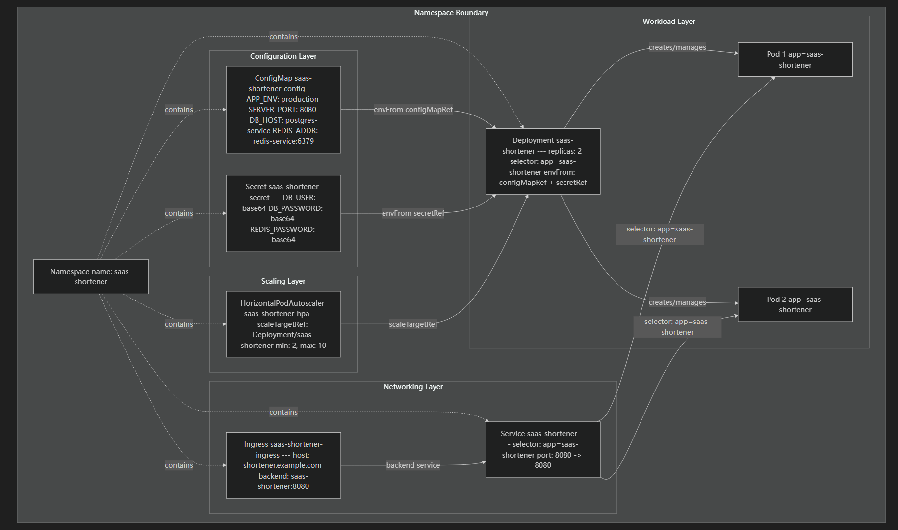
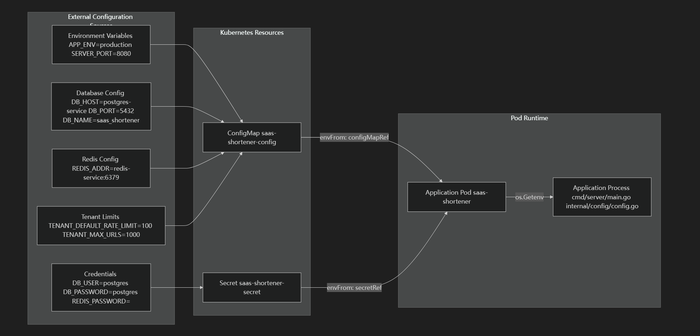
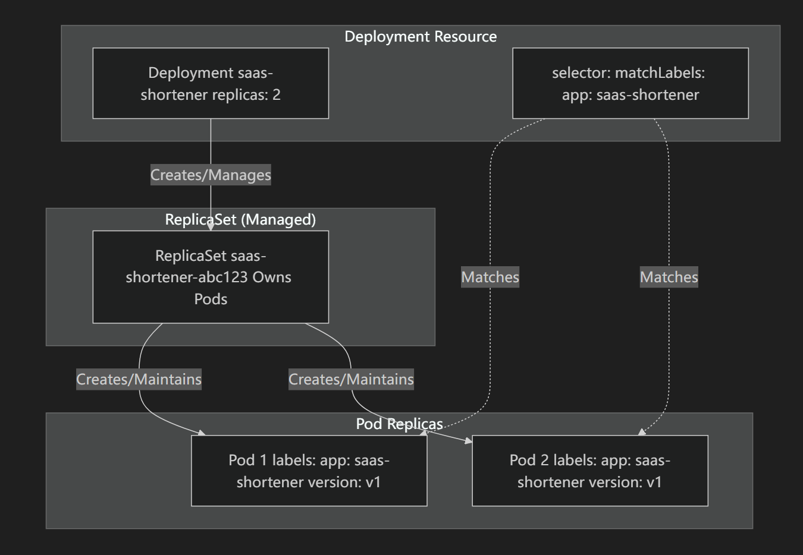

# 生产环境部署

## 资源依赖关系图




## 配置数据流




# 部署配置

## 副本管理和选择器




## 滚动更新策略

```
# 滚动更新策略
strategy:
  type: RollingUpdate
  rollingUpdate:
    maxUnavailable: 0    # 更新时不允许有不可用的 Pod（零停机）
    maxSurge: 1          # 更新时最多多创建 1 个 Pod
```

| Parameter      | Value           | Effect                                                   |
| :------------- | :-------------- | :------------------------------------------------------- |
| type           | `RollingUpdate` | Gradual replacement (vs Recreate)                        |
| maxUnavailable | `0`             | No existing Pods can be unavailable during update        |
| maxSurge       | `1`             | One additional Pod can be created above desired replicas |

### 零停机时间保证

借助`maxUnavailable: 0`Kubernetes，可以确保所有现有副本在更新期间保持可用。结合 Kubernetes `maxSurge: 1`，更新过程如下：

1. 使用更新后的镜像/配置创建 1 个新 Pod（总共：3 个 Pod）
2. 等待新的 Pod 通过所有健康探测（启动 → 就绪）
3. 准备就绪后，终止 1 个旧 Pod（恢复到 2 个 Pod）。
4. 重复此操作直至所有 Pod 都更新完毕。


### Pod模板规范


