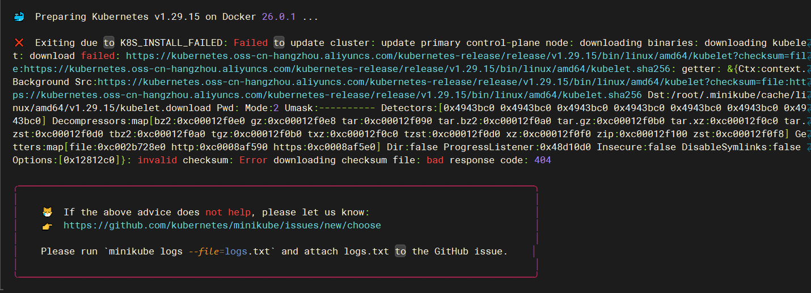
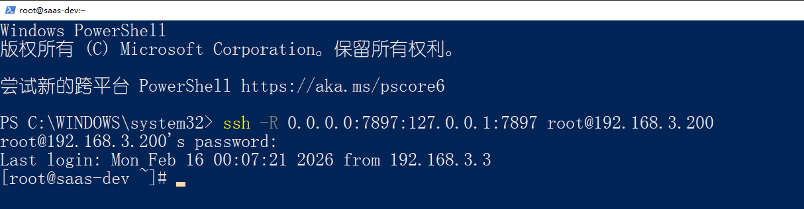
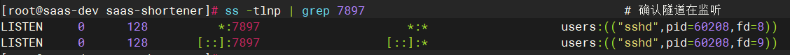
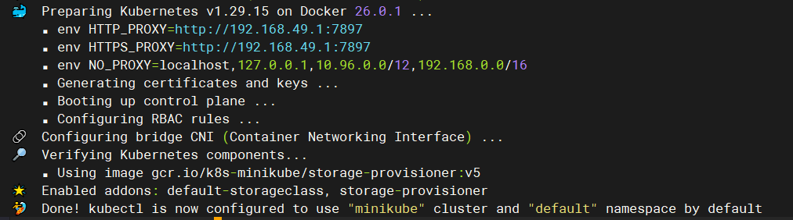
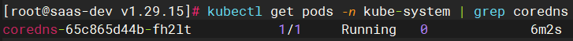
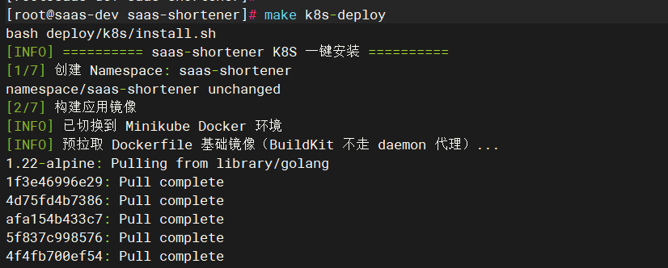
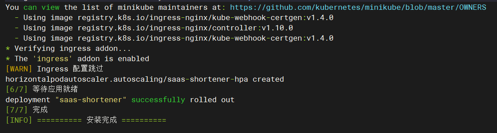
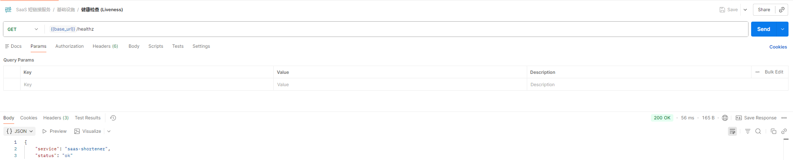

# 虚拟机 Kubernetes 部署指南

> 目标：在 CentOS 7 虚拟机（4C8G）上安装 K8S 单节点集群，部署本项目，并通过 Dashboard 可视化管理。
>
> 方案选择：使用 **Minikube**（单节点 K8S），适合学习和开发环境。

---

## 方案选型

在虚拟机上搭建 K8S 有多种方式：

| 方案 | 节点数 | 难度 | 资源占用 | 适合场景 |
|------|--------|------|---------|---------|
| **Minikube** | 单节点 | ⭐ 简单 | ~2GB 内存 | **学习入门（推荐）** |
| **k3s** | 单/多节点 | ⭐⭐ 简单 | ~512MB 内存 | 轻量级生产/边缘计算 |
| **kubeadm** | 多节点 | ⭐⭐⭐ 较难 | 每节点 ~2GB | 正式生产环境 |
| **Kind** | 单节点 | ⭐ 简单 | ~2GB 内存 | CI/CD 测试 |

> 虚拟机是 4C8G 单台，Minikube 最合适。如果以后想模拟多节点生产环境，可以用 kubeadm。

---

## 一、前置准备

### 1.1 确认 Docker 已安装

Minikube 需要容器运行时，你的虚拟机上应该已经有 Docker：

```bash
docker --version
# Docker version 24.x.x 或更高
```

如果没有，先安装 Docker：

```bash
请参考：https://blog.shpym.cn/index.php/archives/83/
```

### 1.2 配置 Docker 镜像加速（关键！影响后续所有镜像拉取速度）

Minikube 启动时要拉取大量 K8S 组件镜像（kube-apiserver、etcd、coredns 等），不配加速会非常慢甚至超时。

```bash
# 配置 Docker 镜像加速器
sudo mkdir -p /etc/docker
sudo tee /etc/docker/daemon.json <<-'EOF'
{
  "registry-mirrors": [
    "https://docker.1ms.run",
    "https://docker.xuanyuan.me",
    "https://docker.ketches.cn",
    "https://docker.m.daocloud.io",
    "https://dockerpull.org"
  ],
  "dns": ["223.5.5.5", "114.114.114.114"],
  "log-driver": "json-file",
  "log-opts": {
    "max-size": "10m",
    "max-file": "3"
  }
}
EOF

# 重启 Docker 使配置生效
sudo systemctl daemon-reload
sudo systemctl restart docker

# 验证加速器是否生效
docker info | grep -A 5 "Registry Mirrors"
```

> ⚠️ 镜像加速器地址可能失效，如遇到拉取超时，搜索"docker 镜像加速 2026"获取最新可用地址。

### 1.3 关闭 swap（K8S 要求）

```bash
# 临时关闭
sudo swapoff -a

# 永久关闭（注释掉 swap 行）
sudo sed -i '/ swap / s/^/#/' /etc/fstab

# 验证
free -h
# Swap 行应该全是 0
```

### 1.4 关闭 SELinux

```bash
# 临时关闭
sudo setenforce 0

# 永久关闭
sudo sed -i 's/^SELINUX=enforcing$/SELINUX=permissive/' /etc/selinux/config
```

---

## 二、安装 kubectl（K8S 命令行工具）

`kubectl` 是操作 K8S 集群的命令行工具，所有操作都通过它完成。

**方式1：使用 yum 安装（CentOS 推荐，最简单）**

```bash
# 添加阿里云 Kubernetes yum 源
cat <<EOF | sudo tee /etc/yum.repos.d/kubernetes.repo
[kubernetes]
name=Kubernetes
baseurl=https://mirrors.aliyun.com/kubernetes-new/core/stable/v1.29/rpm/
enabled=1
gpgcheck=1
gpgkey=https://mirrors.aliyun.com/kubernetes-new/core/stable/v1.29/rpm/repodata/repomd.xml.key
EOF

# 安装
sudo yum install -y kubectl

# 验证
kubectl version --client
```

---

## 三、安装 Minikube

### 3.1 下载安装 Minikube

**使用国内镜像下载（推荐）：**

```bash
# 方式：通过 npmmirror（阿里前端镜像站，速度快）
curl -LO https://registry.npmmirror.com/-/binary/minikube/v1.33.0/minikube-linux-amd64

# 安装
chmod +x minikube-linux-amd64
sudo mv minikube-linux-amd64 /usr/local/bin/minikube

# 验证
minikube version
```

### 3.2 预拉取 kicbase 基础镜像

Minikube 使用 Docker 驱动时，会创建一个 Docker 容器来模拟 K8S 节点。这个容器的基础镜像叫 **kicbase**（Kubernetes In Container base），里面预装了 kubelet、kubeadm、容器运行时等 K8S 节点所需的全部组件。

`minikube start` 时会自动从 `gcr.io`（Google Container Registry）拉取 kicbase，但国内无法访问 `gcr.io`。解决方法是从 Docker Hub 上的镜像仓库预拉取，再打上 Minikube 期望的标签：

```bash
# 1. 从 Docker Hub 拉取 kicbase 基础镜像
docker pull kicbase/stable:v0.0.43

# 2. 打上 Minikube 期望的标签
docker tag kicbase/stable:v0.0.43 gcr.io/k8s-minikube/kicbase:v0.0.43

# 3. 确认镜像已就位
docker images | grep kicbase
```

> **版本号说明**：`v0.0.43` 对应 Minikube `v1.33.0`。不同 Minikube 版本需要不同的 kicbase 版本，可通过 `minikube start --dry-run` 或查看 [Minikube Release Notes](https://github.com/kubernetes/minikube/releases) 确认。

### 3.3 预缓存 K8S 二进制文件

`minikube start` 会自动下载 kubeadm、kubelet、kubectl 二进制文件。如果使用了 `--image-mirror-country=cn`，可能因为阿里云 OSS 上缺少对应版本的 sha256 校验文件而报 404 错误。

解决方法：去掉 `--image-mirror-country=cn`，手动预缓存二进制文件：



```bash
# 1. 创建缓存目录（版本号与 --kubernetes-version 一致）
mkdir -p ~/.minikube/cache/linux/amd64/v1.29.15/

# 2. 下载对应版本的二进制文件(下载慢的话可以windows下载好导入)
cd ~/.minikube/cache/linux/amd64/v1.29.15/
curl -L -o kubectl https://dl.k8s.io/release/v1.29.15/bin/linux/amd64/kubectl
curl -L -o kubeadm https://dl.k8s.io/release/v1.29.15/bin/linux/amd64/kubeadm
curl -L -o kubelet https://dl.k8s.io/release/v1.29.15/bin/linux/amd64/kubelet
chmod +x kubeadm kubelet kubectl

# 3. 确认三个文件都在
ls -lh ~/.minikube/cache/linux/amd64/v1.29.15/
```

> 如果 `dl.k8s.io` 下载慢，可使用代理或从 GitHub Mirror 下载。

### 3.4 启动 Minikube 集群

```bash
minikube start \
  --driver=docker \
  --cpus=2 \
  --memory=4096 \
  --image-repository=registry.cn-hangzhou.aliyuncs.com/google_containers \
  --kubernetes-version=v1.29.15 \
  --force \
  --base-image=gcr.io/k8s-minikube/kicbase:v0.0.43
```

| 参数 | 作用 |
|------|------|
| `--driver=docker` | 使用 Docker 作为运行时（不需要 VirtualBox） |
| `--cpus=2` | 分配 2 核 CPU |
| `--memory=4096` | 分配 4GB 内存 |
| `--image-repository=registry...` | 指定阿里云 K8S 镜像仓库（核心提速参数） |
| `--kubernetes-version=v1.29.15` | 指定 K8S 版本，避免拉取 latest 时反复查询 |
| `--force` | 允许以 root 用户运行（学习环境需要） |
| `--base-image=gcr.io/...kicbase:v0.0.43` | 使用 3.2 步骤预拉取的本地 kicbase 镜像，跳过从 gcr.io 下载 |

> `--force` 是因为 Minikube 默认不允许 root 用户使用 Docker 驱动。学习环境直接加 `--force` 即可，生产环境建议创建普通用户运行。

> 配合阿里云镜像仓库 + 预拉取 kicbase 后，首次启动通常 **3-5 分钟**即可完成（不加速可能 30 分钟甚至失败）。

### 3.5 配置代理访问 Docker Hub

如果 Docker 镜像加速器不稳定，或需要拉取 Docker Hub 官方镜像（如 Ingress Controller），可通过代理方案一次性解决所有镜像拉取问题。

#### 为什么需要代理

Minikube 运行在 Docker 容器中，内部有独立的 Docker daemon。即使宿主机 Docker 配了镜像加速，Minikube 内部的 Docker 并不继承这些配置。配置代理后，Minikube 内部可直接拉取 Docker Hub 镜像，无需预拉取或使用镜像站。

#### 方案：SSH 反向隧道 + Minikube 代理

适用场景：Windows 主机上有 Clash 等代理工具，需要将代理能力"穿透"到 Linux 虚拟机及其中的 Minikube。

**原理说明**

代理（Clash）跑在 Windows 上，但需要拉镜像的是 Linux 虚拟机里的 Minikube 容器。中间隔着两层网络，需要用 SSH **反向**隧道让 Linux 能借用 Windows 的代理：

```
┌──────── Windows 主机 ────────┐
│                               │
│   Clash 代理 127.0.0.1:7897  │  ← 能翻墙，能访问 Docker Hub
│               ▲               │
│               │               │
│          SSH 反向隧道         │
└───────────────┼───────────────┘
                │
                ▼
┌──────── Linux 虚拟机 ────────┐
│                               │
│   0.0.0.0:7897 (隧道监听)    │  ← Linux 本身没有代理
│        ▲                      │
│        │                      │
│   ┌────┴───────────────┐     │
│   │  Minikube 容器      │     │
│   │                     │     │
│   │  docker pull xxx ───┼──▶ 192.168.49.1:7897 (宿主机)
│   │                     │     │     │
│   └─────────────────────┘     │     ▼
│                               │  SSH 隧道 → Windows Clash → Docker Hub
└───────────────────────────────┘
```

完整的数据流：`Minikube docker pull` → `192.168.49.1:7897`（Minikube 网关） → Linux `0.0.0.0:7897`（SSH 隧道监听） → SSH 加密转发 → Windows `127.0.0.1:7897`（Clash） → Docker Hub → 镜像数据原路返回。

> **为什么用反向隧道（`-R`）而不是正向（`-L`）？**
>
> - 正向隧道（`-L`）：在**本机**开端口，转发到远端 → 适合 Windows 访问 Linux（如 Lens 连 K8S）
> - 反向隧道（`-R`）：在**远端**开端口，转发到本机 → 适合 Linux 借用 Windows 的服务（如代理）
>
> 这里是 Linux 要借用 Windows 的 Clash，所以用 `-R`。

**第一步：修改虚拟机 SSH 配置**

```bash
# 启用 GatewayPorts，允许非 127.0.0.1 地址访问转发的端口
sed -i 's/#*GatewayPorts.*/GatewayPorts yes/' /etc/ssh/sshd_config
systemctl restart sshd
```

> 必须启用 `GatewayPorts`，否则 SSH 反向隧道只绑定 `127.0.0.1`，Minikube 容器通过 `192.168.49.1` 访问不到。

**第二步：从 Windows 建立反向隧道**



```powershell
ssh -R 0.0.0.0:7897:127.0.0.1:7897 root@192.168.3.200
```

| 参数 | 含义 |
|------|------|
| `-R` | 反向隧道（在远端 Linux 上开监听端口） |
| `0.0.0.0:7897` | Linux 上监听**所有网卡**的 7897 端口 |
| `127.0.0.1:7897` | 把流量转发到 Windows 本地的 Clash 代理 |
| `root@192.168.3.200` | 通过 SSH 连接到 Linux 虚拟机 |

> 必须绑定 `0.0.0.0` 而非 `127.0.0.1`：Minikube 容器通过 `192.168.49.1`（Minikube 专用网桥）访问 Linux 宿主机，不是 `127.0.0.1`，所以必须监听所有网卡。

**第三步：获取 Minikube 容器的网关 IP**

```bash
# Minikube 容器看到的宿主机 IP（不是 172.17.0.1！）
minikube ssh -- ip route show default
# 输出示例: default via 192.168.49.1 dev eth0
```

> **注意**：Minikube 使用独立网络（`192.168.49.0/24`），网关不是 Docker 默认网桥的 `172.17.0.1`。

**第四步：验证代理连通性**



```bash
ss -tlnp | grep 7897                                     # 确认隧道在监听
curl -x http://192.168.49.1:7897 https://www.google.com  # 测试代理可用
```

**第五步：带代理参数启动 Minikube**

如果已有集群需要先删除再重建：



```bash
minikube delete

minikube start \
  --driver=docker \
  --cpus=2 \
  --memory=4096 \
  --kubernetes-version=v1.29.15 \
  --force \
  --base-image=gcr.io/k8s-minikube/kicbase:v0.0.43 \
  --docker-env=HTTP_PROXY=http://192.168.49.1:7897 \
  --docker-env=HTTPS_PROXY=http://192.168.49.1:7897 \
  --docker-env=NO_PROXY=localhost,127.0.0.1,10.96.0.0/12,192.168.0.0/16
```

| 参数 | 作用 |
|------|------|
| `--docker-env=HTTP_PROXY` | 设置 Minikube 内部 Docker daemon 的 HTTP 代理 |
| `--docker-env=HTTPS_PROXY` | 设置 HTTPS 代理（值仍用 `http://`，指代理协议） |
| `--docker-env=NO_PROXY` | 排除集群内部网段，避免 Pod 间通信走代理 |

#### 注意事项

**HTTPS_PROXY 的值为什么是 `http://` 而不是 `https://`？**

`HTTPS_PROXY` 中的 "HTTPS" 指要代理的**目标流量**是 HTTPS，而不是代理服务器本身使用 HTTPS 协议。

**SSH 隧道断开怎么办？**

隧道会在 SSH 连接断开时失效。如果 `docker pull` 突然报 `connection refused`：

```bash
ss -tlnp | grep 7897  # 检查隧道是否还在
# 没有输出 → 在 Windows 重建隧道
```

**BuildKit 的 FROM 指令不走 Docker daemon 代理**

即使配了代理，`docker build` 的 `FROM` 阶段可能仍然超时。解决方法是在构建前预拉取基础镜像：

```bash
eval $(minikube docker-env)
docker pull golang:1.22-alpine
docker pull alpine:3.19
docker build -t app:latest -f deploy/docker/Dockerfile .
```

> 项目的 `install.sh` 已内置此逻辑，无需手动操作。

### 3.6 验证集群状态

```bash
# 查看集群状态
minikube status

# 期望输出：
# minikube
# type: Control Plane
# host: Running
# kubelet: Running
# apiserver: Running
# kubeconfig: Configured

# 查看节点
kubectl get nodes

# 期望输出：
# NAME       STATUS   ROLES           AGE   VERSION
# minikube   Ready    control-plane   1m    v1.29.x

# 查看系统 Pod
kubectl get pods -n kube-system
```

#### CoreDNS 崩溃导致 DNS 解析失败

**现象**

应用 Pod 持续 `CrashLoopBackOff`，日志显示数据库连接失败：

检查 CoreDNS 发现也在崩溃：

```bash
kubectl get pods -n kube-system | grep coredns
# coredns-xxx   0/1   CrashLoopBackOff

kubectl logs -l k8s-app=kube-dns -n kube-system
# Listen: listen tcp :53: bind: permission denied
```

**根因**

CoreDNS 新版本以非 root 用户运行，缺少 `NET_BIND_SERVICE` Linux 能力，无法绑定 53 端口（特权端口 < 1024）。这是 K8s v1.29+ 的已知兼容性问题。

```
CoreDNS 启动 → 绑定 :53 → permission denied → 崩溃
  ↓
集群 DNS 不可用 → Pod 无法解析 Service 域名 → 应用连不上数据库 → CrashLoopBackOff
```

**解决方案**

需要同时修改多个安全策略字段，使用 JSON patch 精确替换（strategic merge 对数组和布尔值可能不生效）：

```bash
# 1. 修复 capabilities 和权限
kubectl -n kube-system patch deployment coredns --type='json' -p='[
  {"op": "replace", "path": "/spec/template/spec/containers/0/securityContext/allowPrivilegeEscalation", "value": true},
  {"op": "replace", "path": "/spec/template/spec/containers/0/securityContext/capabilities/drop", "value": []},
  {"op": "add", "path": "/spec/template/spec/containers/0/securityContext/runAsUser", "value": 0},
  {"op": "add", "path": "/spec/template/spec/containers/0/securityContext/runAsNonRoot", "value": false}
]'

# 2. 等待重启
kubectl rollout restart deployment/coredns -n kube-system
kubectl rollout status deployment/coredns -n kube-system --timeout=60s

# 3. 验证
kubectl get pods -n kube-system | grep coredns
# 应显示 1/1 Running
```

> **注意**：仅添加 `NET_BIND_SERVICE` 能力不够，还需要 `runAsUser: 0`（以 root 运行）和清除 `drop: ["ALL"]`。原始 securityContext 中 `drop: ALL` 会覆盖 `add`，且非 root 用户即使有该能力也可能因内核限制无法绑定特权端口。

修复 CoreDNS 后，重启应用：

```bash
kubectl rollout restart deployment/saas-shortener -n saas-shortener
```



---

## 四、部署应用





```
Kubernetes:
  make k8s-deploy    - 一键部署到 Minikube（含镜像、数据库、应用）
  make k8s-uninstall - 一键卸载（删除命名空间及所有资源）
  make k8s-apply     - 仅应用 K8s 配置（已有数据库时用）
  make k8s-delete    - 删除 K8s 配置
  make k8s-status    - 查看 K8s 状态
```

项目已提供一键部署和一键卸载脚本，在项目根目录执行即可。

### 4.1 一键部署

```bash
# 前置：minikube 已启动 (minikube start)
make k8s-deploy
```

脚本将依次完成：构建镜像 → 创建 Namespace → 部署 PostgreSQL/Redis → 部署应用 → 启用 Ingress/HPA。

### 4.2 一键卸载

```bash
make k8s-uninstall
```

脚本会删除 `saas-shortener` 命名空间及其下所有资源（应用、数据库、Redis、配置等）。卸载前会要求确认。

**免确认强制卸载：**

```bash
K8S_UNINSTALL_FORCE=1 ./deploy/k8s/uninstall.sh
```


### 4.3 验证部署状态

```bash
# 查看所有资源
kubectl get all -n saas-shortener

# 查看 Pod 状态（等待 STATUS 变为 Running）
kubectl get pods -n saas-shortener -w

# 期望输出：
# NAME                              READY   STATUS    RESTARTS   AGE
# saas-shortener-xxxx-yyyy          1/1     Running   0          30s
# saas-shortener-xxxx-zzzz          1/1     Running   0          30s
# postgres                          1/1     Running   0          5m
# redis                             1/1     Running   0          5m

# 查看 Pod 日志
kubectl logs -f deployment/saas-shortener -n saas-shortener

# 如果 Pod 状态异常，查看详细信息
kubectl describe pod <pod-name> -n saas-shortener
```

### 4.4 测试 API

部署成功了，但 K8S 集群内的服务不会自动暴露到宿主机端口。需要手动建立端口转发才能访问



```
# 方式1：端口转发（推荐）
kubectl port-forward svc/saas-shortener-service 8080:80 -n saas-shortener --address=0.0.0.0 &

# 然后在虚拟机上访问：curl http://localhost:8080
# 或从 Windows 访问：http://192.168.3.200:8080
```

---

## 五、开机自启配置

每次重启虚拟机后，需要手动 `minikube start` 和 `kubectl port-forward`，比较麻烦。通过 systemd 可以实现开机自动启动。

### 5.1 Minikube 开机自启

创建启动脚本和 systemd 服务：

```bash
sudo tee /usr/local/bin/minikube-start.sh <<'SCRIPT'
#!/bin/bash
LOG=/var/log/minikube-start.log
echo "$(date) - Starting Minikube..." >> $LOG
/usr/local/bin/minikube start --force >> $LOG 2>&1
echo "$(date) - Minikube start exited with code $?" >> $LOG
SCRIPT

sudo chmod +x /usr/local/bin/minikube-start.sh
```

```bash
# 2. 创建 systemd 服务
sudo tee /etc/systemd/system/minikube.service <<'EOF'
[Unit]
Description=Minikube Kubernetes Cluster
After=docker.service
Requires=docker.service

[Service]
Type=oneshot
RemainAfterExit=yes
User=root
ExecStart=/usr/local/bin/minikube-start.sh
ExecStop=/usr/local/bin/minikube stop
TimeoutStartSec=300

[Install]
WantedBy=multi-user.target
EOF

# 启用开机自启
sudo systemctl daemon-reload
sudo systemctl enable minikube
```

> `systemctl start minikube` 会等待 1-3 分钟直到集群就绪，这是正常行为（不是卡住）。
> 启动日志记录在 `/var/log/minikube-start.log`，可随时查看进度。

验证：

```bash
# 重启虚拟机
sudo reboot

# 重启后等 2-3 分钟，检查状态
systemctl status minikube       # 应显示 active (exited)
minikube status                 # 应显示 Running
tail -f /var/log/minikube-start.log # 查看启动日志
```

### 5.2 port-forward 自动运行

创建 systemd 服务，在 Minikube 启动后自动将应用端口暴露到 `0.0.0.0:8080`。

**关键：ExecStartPre 等待逻辑**

port-forward 依赖应用 Pod 已经就绪，所以需要先等待 Pod 变为 `Running` 状态再启动转发：

```bash
until kubectl get pod -n saas-shortener -l app=saas-shortener \
    --field-selector=status.phase=Running -o name 2>/dev/null | grep -q pod; 
do 
    sleep 5; 
done
```

| 部分                                    | 含义                                           |
| --------------------------------------- | ---------------------------------------------- |
| `until ... do ... done`                 | 循环直到条件为真才退出                         |
| `kubectl get pod -n saas-shortener`     | 查询 saas-shortener 命名空间的 Pod             |
| `-l app=saas-shortener`                 | 标签选择器，只查询 app=saas-shortener 的 Pod   |
| `--field-selector=status.phase=Running` | 只选择状态为 Running 的 Pod                    |
| `-o name`                               | 只输出 Pod 名称（如 `pod/saas-shortener-xxx`） |
| `2>/dev/null`                           | 丢弃错误输出（命名空间或 Pod 还不存在时）      |
| `\| grep -q pod`                        | 静默检查输出中是否包含 "pod" 字符串            |
| `sleep 5`                               | 如果没找到就等 5 秒后再试                      |

这样可以避免 port-forward 在 Pod 还未启动时就尝试连接导致失败。

**创建服务**

```bash
# 先查找 kubectl 实际路径
KUBECTL_PATH=$(which kubectl)
echo "kubectl 路径: $KUBECTL_PATH"

# 创建服务（动态替换路径）
sudo tee /etc/systemd/system/k8s-port-forward.service <<EOF
[Unit]
Description=Kubectl Port Forward for saas-shortener
After=minikube.service
Requires=minikube.service

[Service]
Type=simple
User=root
# 等待 Pod 就绪后再转发
ExecStartPre=/bin/bash -c 'until $KUBECTL_PATH get pod -n saas-shortener -l app=saas-shortener --field-selector=status.phase=Running -o name 2>/dev/null | grep -q pod; do sleep 5; done'
ExecStart=$KUBECTL_PATH port-forward svc/saas-shortener-service 8080:80 -n saas-shortener --address=0.0.0.0
Restart=always
RestartSec=10

[Install]
WantedBy=multi-user.target
EOF

# 启用
sudo systemctl daemon-reload
sudo systemctl enable k8s-port-forward

# 立即启动（不用等重启）
sudo systemctl start k8s-port-forward

# 查看状态
sudo systemctl status k8s-port-forward
```

服务特性说明：

| 配置                     | 作用                                            |
| ------------------------ | ----------------------------------------------- |
| `After=minikube.service` | 确保 Minikube 先启动完成                        |
| `ExecStartPre`           | 等待应用 Pod 变为 Running 后才开始转发          |
| `Restart=always`         | 如果 port-forward 断开（如 Pod 重建），自动重连 |
| `RestartSec=10`          | 断开后 10 秒重试                                |
| `--address=0.0.0.0`      | 监听所有网卡，允许外部访问                      |

### 5.3 验证自动化效果

```bash
# 重启虚拟机
sudo reboot

# 重启后等待约 1-2 分钟，检查服务状态
systemctl status minikube          # 应显示 active (exited)
systemctl status k8s-port-forward  # 应显示 active (running)

# 测试访问
curl http://localhost:8080/healthz

# 从 Windows 访问
# http://192.168.3.200:8080
```

### 5.4 管理命令

```bash
# 查看日志
journalctl -u minikube -f
journalctl -u k8s-port-forward -f

# 手动重启 port-forward
sudo systemctl restart k8s-port-forward

# 临时禁用自启
sudo systemctl disable minikube
sudo systemctl disable k8s-port-forward
```

---

## 六、常用运维操作

### 6.1 常用排查命令速查

```
# ===== 状态查看 =====
kubectl get pods -n saas-shortener              # Pod 状态
kubectl get all -n saas-shortener               # 所有资源
kubectl describe pod <name> -n saas-shortener   # Pod 详情（含 Events）
kubectl logs <pod-name> -n saas-shortener       # Pod 日志

# ===== Docker 环境 =====
docker info | grep "Name:"                      # 当前 Docker 是宿主机还是 Minikube
eval $(minikube docker-env)                      # 切换到 Minikube Docker
eval $(minikube docker-env -u)                   # 切回宿主机 Docker
minikube image ls                                # 查看 Minikube 中的镜像

# ===== 代理排查 =====
ss -tlnp | grep 7897                            # SSH 隧道是否在监听
minikube ssh -- ip route show default            # Minikube 容器的网关 IP
curl -x http://192.168.49.1:7897 https://google.com  # 测试代理连通

# ===== Ingress 排查 =====
kubectl get pods,jobs -n ingress-nginx           # Ingress 组件状态
kubectl describe pod <name> -n ingress-nginx     # 查看拉取的镜像和错误

# ===== 清理 =====
K8S_UNINSTALL_FORCE=1 make k8s-uninstall        # 一键卸载
minikube addons disable ingress                  # 禁用 Ingress 插件
minikube delete                                  # 删除 Minikube 集群
```

### 6.2 更新应用版本

```bash
# 1. 重新构建镜像
eval $(minikube docker-env)
docker build -t saas-shortener:v2 -f deploy/docker/Dockerfile .

# 2. 更新 Deployment 的镜像
kubectl set image deployment/saas-shortener \
  saas-shortener=saas-shortener:v2 \
  -n saas-shortener

# 3. 查看滚动更新进度
kubectl rollout status deployment/saas-shortener -n saas-shortener
```

### 6.3 回滚

```bash
# 回滚到上一个版本
kubectl rollout undo deployment/saas-shortener -n saas-shortener

# 查看历史版本
kubectl rollout history deployment/saas-shortener -n saas-shortener
```

### 6.4 扩缩容

```bash
# 手动扩容到 4 个 Pod
kubectl scale deployment/saas-shortener --replicas=4 -n saas-shortener

# 查看 HPA 自动扩缩容状态
kubectl get hpa -n saas-shortener
```

### 6.5 查看日志和调试

```bash
# 查看 Pod 日志
kubectl logs -f <pod-name> -n saas-shortener

# 进入 Pod 容器
kubectl exec -it <pod-name> -n saas-shortener -- /bin/sh

# 查看 Pod 事件（排查启动失败）
kubectl describe pod <pod-name> -n saas-shortener

# 查看所有事件
kubectl get events -n saas-shortener --sort-by='.lastTimestamp'
```

### 6.6 Minikube 管理

```bash
# 停止集群（保留数据）
minikube stop

# 启动集群
minikube start

# 删除集群（清除所有数据！）
minikube delete

# 查看 Minikube IP
minikube ip

# 查看已启用的插件
minikube addons list
```


## 七、K8S 可视化面板

### Lens（桌面客户端）

如果你想在 **Windows 主机**上远程管理虚拟机中的 K8S，Lens 是最佳选择。

#### 方式 1：自动化脚本（推荐）

项目提供了自动化脚本，一键完成所有配置。

**双击运行（最简单）：**

直接双击 `scripts\connect-lens.bat` 即可运行，无需打开命令行。

脚本会自动：
1. 从 Linux 虚拟机导出 kubeconfig
2. 复制到 Windows 本地（`~\.kube\minikube-config`）
5. 建立 SSH 隧道（后台运行）

执行完成后，在 Lens 中 File → Add Cluster → 选择 `C:\Users\你的用户名\.kube\minikube-config` 即可。

**隧道是否建立成功：**

```powershell
netstat -ano | findstr :8443
```

#### 方式 2：手动配置

**安装与连接步骤：**

**第一步：导出 kubeconfig（在 Linux 虚拟机上执行）**

必须使用 `--flatten` 参数将证书内嵌到文件中，否则 kubeconfig 里会包含 Linux 文件路径（如 `/root/.minikube/ca.crt`），Windows 上找不到这些文件会报 `unable to read client-cert` 错误。

```bash
kubectl config view --flatten > /tmp/kubeconfig-export.yaml
```

**第二步：复制到 Windows**

```powershell
scp root@192.168.3.200:/tmp/kubeconfig-export.yaml C:\Users\shihao\.kube\minikube-config
```

**第三步：编辑 kubeconfig，添加跳过证书验证**

- 在 `cluster` 下添加 `insecure-skip-tls-verify: true`（因为 SSH 隧道改变了访问地址，服务端证书的 SAN 不匹配）：
- 删除 `certificate-authority-data`

```yaml
clusters:
- cluster:
    certificate-authority-data: LS0tLS1C...（删除!!!）
    insecure-skip-tls-verify: true
    server: https://127.0.0.1:8443
  name: minikube
```

**第四步：查看 Minikube API Server 的实际端口**

Minikube 用 Docker 驱动时，API Server 端口会被映射到宿主机的随机端口：

```bash
# 在 Linux 上执行
docker port minikube
# 输出示例:
# 8443/tcp -> 127.0.0.1:32779
```

记住 `8443/tcp` 对应的实际端口（本例为 `32779`）。

**第五步：建立 SSH 隧道（在 Windows PowerShell 执行）**

Lens 在 Windows 上，API Server 在 Linux 虚拟机的 Docker 容器里，中间隔着**两层网络隔离**，必须用 SSH 隧道打通：

```
┌──────── Windows ────────┐
│                          │
│  Lens → 127.0.0.1:8443  │
│              │           │
│         SSH 隧道         │
└──────────────┼───────────┘
               ▼
┌──────── Linux VM ───────┐
│  127.0.0.1:32779        │  ← Docker 端口映射（仅绑定 127.0.0.1，外部不可达）
│         │                │
│  ┌──────▼──────────┐    │
│  │ Minikube 容器    │    │
│  │ API Server:8443 │    │
│  └─────────────────┘    │
└──────────────────────────┘
```

为什么需要隧道：
- **第一层隔离**：API Server 运行在 Minikube Docker 容器内部，通过 Docker 端口映射暴露到 Linux 宿主机，但只绑定了 `127.0.0.1`（本机回环），从外部访问 `192.168.3.200:32779` 不通
- **第二层隔离**：Windows 和 Linux 是两台不同的机器，Windows 无法访问 Linux 的 `127.0.0.1`

SSH 隧道将两端桥接起来：

```powershell
ssh -L 8443:127.0.0.1:32779 root@192.168.3.200 -N
```

| 参数 | 含义 |
|------|------|
| `-L 8443:` | 在 Windows 本地监听 8443 端口 |
| `127.0.0.1:32779` | 转发到 Linux 上的 127.0.0.1:32779（Minikube API Server） |
| `root@192.168.3.200` | 通过 SSH 连接到 Linux 虚拟机 |
| `-N` | 不打开远程 Shell，只做端口转发 |

> 端口号 `32779` 替换为第四步查到的实际值。隧道窗口需保持打开。

**第六步：在 Lens 中导入**

File → Add Cluster → 选择 `C:\Users\shihao\.kube\minikube-config`

#### 常见报错

| 报错 | 原因 | 解决 |
|------|------|------|
| `unable to read client-cert /root/.minikube/...` | kubeconfig 中使用了 Linux 文件路径而非内嵌证书 | 用 `kubectl config view --flatten` 重新导出 |
| `channel: open failed: connect refused` | SSH 隧道的目标端口不对 | `docker port minikube` 查实际端口 |
| `Invalid credentials` | 证书数据不完整或被截断 | 用 `scp` 复制文件，不要手动粘贴 |
| `certificate has expired or is not yet valid` | 虚拟机系统时间不对 | `sudo date -s "正确时间"` 并安装 chrony |

### Lens 功能：

- 图形化查看所有 K8S 资源（Pod、Service、Deployment 等）
- 实时日志查看
- 一键进入容器终端
- 资源使用率监控（CPU、内存图表）
- 多集群管理

---

