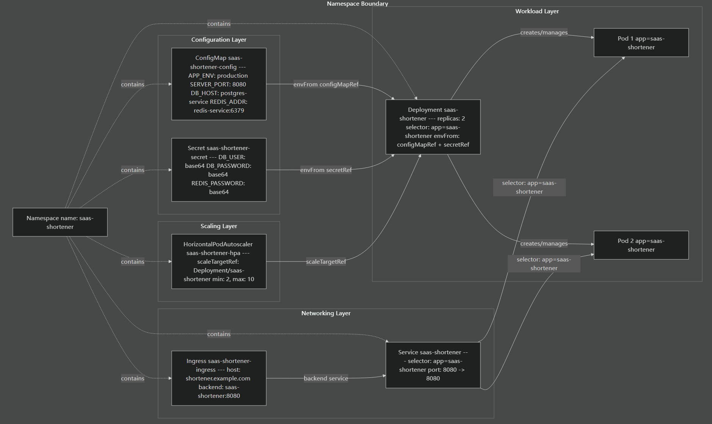
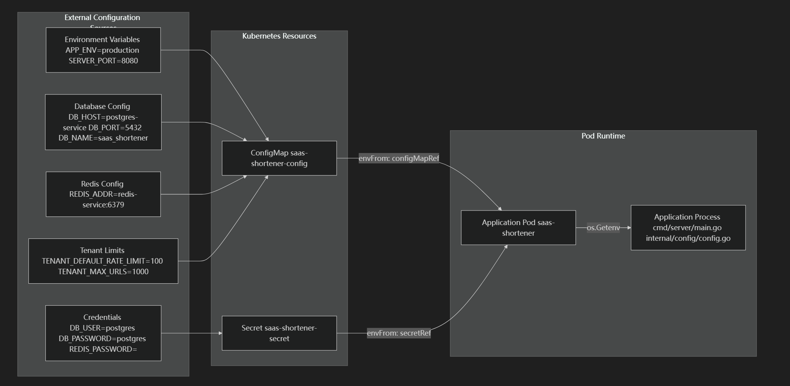

# 概念
- K8S namespace workload pods
- HPA controlled
- Ingress Load Balance Pod
- 连接池配置
https://www.bilibili.com/video/BV1BH4y1g7ad/?spm_id_from=333.337.search-card.all.click&vd_source=818384c9f37f51ddc0e03f10297f1aa2
- Kubernetes ConfigMap/Secret
- 配置热加载
- 自动伸缩容
- kubelet
- ELK/Kibana 或 Loki/Grafana
- QPS
- HPA 通过扩展 pod 来维持可控的单 pod 每秒查询数 (QPS)
- Kubernetes 环境中的零配置日志收集
- 基于 Redis 有序集合的滑动窗口
  - 到期时间为什么两个安全窗口？
  - 分布式限流，假如：pod1 、pod2 同时检查999未到限速1000，通过之后都向redis ADD。是不是redis就到1001了
- 多租户
  - 目前采用共享数据库，表中添加tenant_id
  - todo 生成 API KEY 变为 `JWT`


- k8s 学习：https://zhuanlan.zhihu.com/p/245208287


# Docker 容器化


## Redis

```
redis-server --maxmemory 64mb --maxmemory-policy allkeys-lru
```

```
我来为您解释这个 Redis 启动命令中的参数：

## 参数详解

### `redis-server`
Redis 服务器的可执行文件

### `--maxmemory 64mb`
- **作用**：设置 Redis 实例的最大内存使用量为 64MB
- **说明**：
  - 当 Redis 使用的内存达到 64MB 时，会根据配置的淘汰策略开始删除数据
  - 支持多种单位：b(字节)、kb、mb、gb
  - 这对于控制内存使用和防止系统内存耗尽很重要

### `--maxmemory-policy allkeys-lru`
- **作用**：设置内存淘汰策略为 ALLKEYS-LRU
- **详细说明**：
  - **LRU** = Least Recently Used（最近最少使用）
  - **ALLKEYS** = 对所有键都适用此策略
  - 当内存不足时，Redis 会删除最近最少被访问的键

## 内存淘汰策略选项对比

常见的 `maxmemory-policy` 选项包括：

1. **allkeys-lru** - 在所有键中删除最近最少使用的键 ✅ 您当前的选择
2. **allkeys-lfu** - 在所有键中删除最不经常使用的键
3. **allkeys-random** - 随机删除键
4. **volatile-lru** - 只在设置了过期时间的键中删除最近最少使用的键
5. **volatile-lfu** - 只在设置了过期时间的键中删除最不经常使用的键
6. **volatile-random** - 只在设置了过期时间的键中随机删除
7. **volatile-ttl** - 删除即将过期的键
8. **noeviction** - 不删除任何数据，内存满时返回错误

## 适用场景

您选择的 `allkeys-lru` 策略特别适合：
- 缓存系统
- 需要自动清理旧数据的应用
- 对数据持久性要求不高的场景

这种配置确保了 Redis 在有限的 64MB 内存中始终保存最有价值的数据。
```

- RDB 快照文件、AOF 日志文件


# 生产环境部署

## 资源依赖关系图



## 名词解释&关系

| 名词            | 解释 |
| --------------- | ---- |
| Namespace       |      |
| ConfigMap       |      |
| Secret          |      |
| Deployment      |      |
| Service         |      |
| Ingress         |      |
| HPA             |      |
| Label Selector  |      |
| backend service |      |
| Workload        |      |

## 配置数据流




